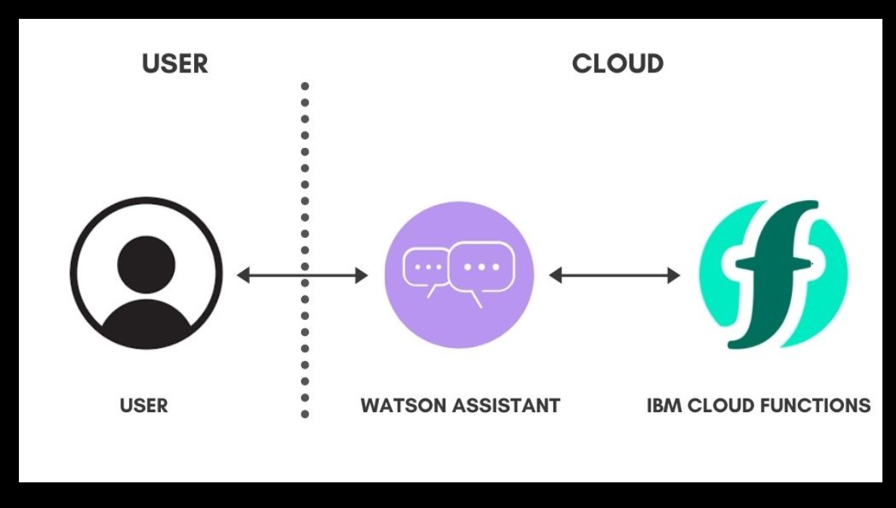
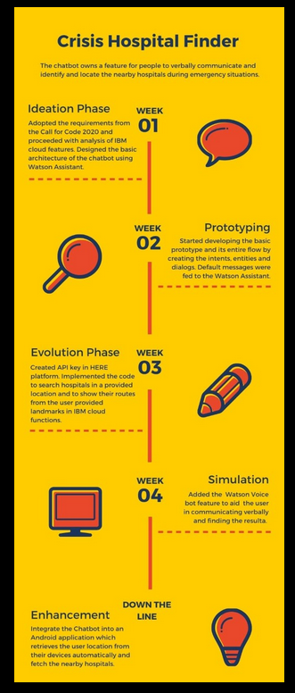
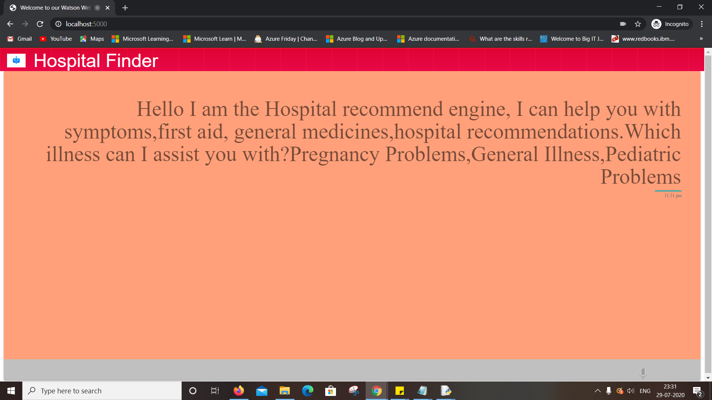

# Submission name

<h2>A technology for finding hospitals during the pandemic</h2>

## Contents

1.[Short description](#short-description) 
2.[The architecture](#the-architecture) 
3.[Long description](#long-description) 
4.[Project roadmap](#project-roadmap) 
5.[Voicebot output](#Output) 
6.[Built with](#built-with)

## Short description

### What's the problem?

During the global pandemic Covid-19,

·It has become critical for pregnant ladies and common man seeking medical help to find hospitals for general health issues.
·People who are new to a location or stuck at different places find it very difficult to find the directions to hospitals from their locations.
·People with less English knowledge might not be able to use the exact phrases for google search.
· Some people only need first aid of some general illness by mentioning their symptoms.

### How can technology help?

As this pandemic situation has created a lot of chaos in identifying the hospitals, we can guide people with the technology and help them in identifying and locating the nearby hospitals during emergency situations. We can also let the people know the symptoms, first aid and medicines for the general illness. So that even before they could reach the hospital they could do some first aid for the patients well in advance. Chatbots could be a boon and very helpful in such cases and to people with less English knowledge who find it difficult in using exact phrases for google search. 

### The idea

To overcome all these problem, we are going to configure a chatbot in IBM Cloud that helps people to feed their location and find nearby hospitals at their convenience, give directions to the hospitals to people who are new to that locality.

## The architecture

1.The user communicates with the Watson Assistant with his query.
2.Watson Assistant responds with the available dialog messages for default queries.
3.When there is a user input for location and landmark, it communicates with the IBM Cloud Service to provide the required results

## Long description

During the global pandemic Covid-19,It has become critical for pregnant ladies and common man seeking medical help to find hospitals for general health issues.People who are new to a location or stuck at different places find it very difficult to find the directions to hospitals from their locations. So we thought of designing a chat bot that can address this issue. Our chatbot will help the users find the symptoms of some common health issue and other related problems. With the help of chatbot we will also be providing the first aid that can be done for their problem and the general medicines as well. If the user wants to reach hospital we will help them in finding the nearest hospitals and we will also guide them with the route for the hospital they choose. We have also added separate flows to help the Pregnant ladies and parents find a find hospital . To accomplish this we used the Watson Assistant to design the chatbot flow.  We made use of the HERE API’s to get the nearest hospital details and routing details. 

## Project roadmap

Note:
 We have completed training the intents in the voice bot and it is accessing the intents and the voice training part in the bot is under progress. 
Github link to access Voicebot:
https://github.com/Parkavias/CrisisBot.git

##Voicebot output

## Built with

* [IBM Watson Assistant](https://https://cloud.ibm.com/catalog?search=watson%20assistant#search_results) - It lets you build conversational interfaces into any application, device , or channel.
* [IBM Cloud Functions](https://cloud.ibm.com/catalog?search=cloud%20functions#search_results) - The compute platform for handing logic

